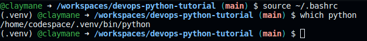

# devops-python-tutorial
https://www.youtube.com/watch?v=kwZNpieUreA

## This specific structure is very common in enterprise CS work.
## Create a project scaffold (software engineering best practices as code)

Creating a cloud based development is advantageous. Cloud based tech stack

### Colab Notebook

This is an example of how to use [colab](https://github.com/claymane/devops-python-tutorial/blob/main/devops_python_tutorial.ipynb)

### Github Codespaces

Build out a python project scaffold:

* [Makefile](https://github.com/claymane/devops-python-tutorial/blob/main/Makefile)
* [requirements.txt](https://github.com/claymane/devops-python-tutorial/blob/main/requirements.txt)
* virtualvenv
* [test_devopsLib.py](https://github.com/claymane/devops-python-tutorial/blob/main/test_devopsLib.py)
* [python_library](https://github.com/claymane/devops-python-tutorial/tree/main/devopsLib)
* Dockerfile
* command-line-tool
* microservice

1. Create a virtualenv: `virtualenv ~/.venv` alternatively `python3 -m venv ~/.venv`
2. Edit my `.bashrc` to automatically load the virtual environment by including `source ~/.venv/bin/activate` at the tail.

3. make all

### AWS Cloudshell
### AWS Cloud9

## Command-Line Tools

## Microservices

## Containerized Continuous Delivery
